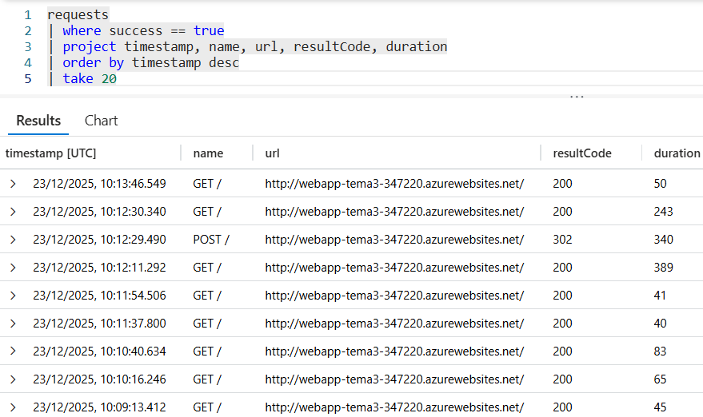
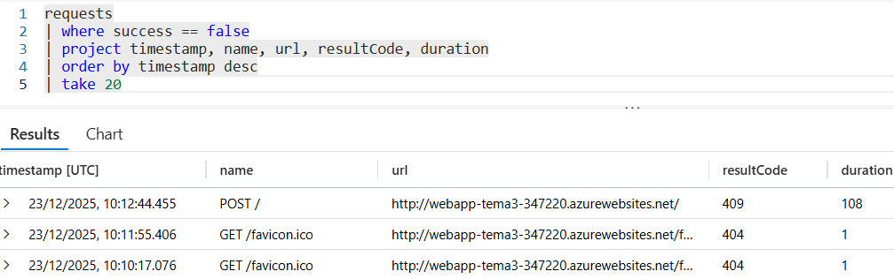
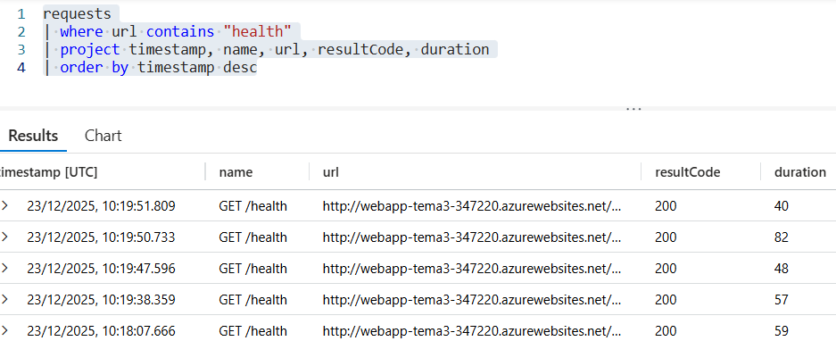
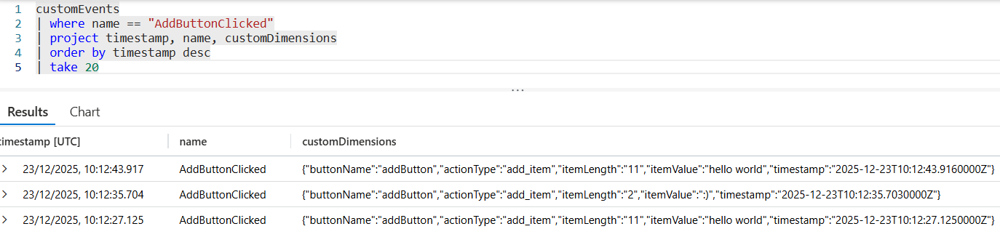
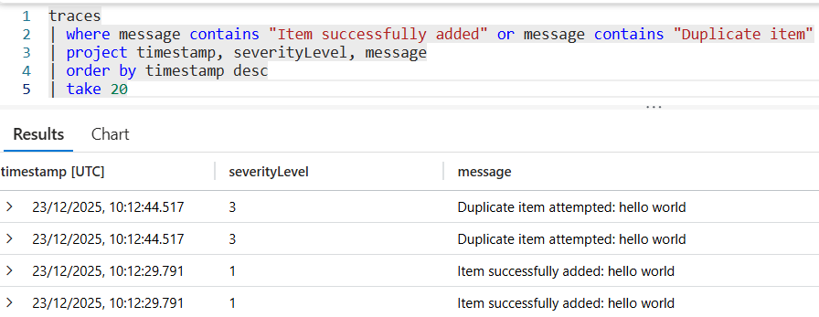
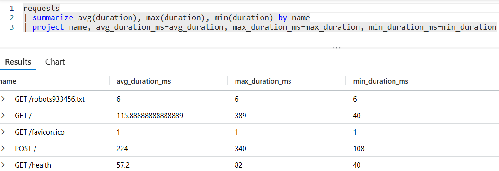

# Homework 3 - Application Telemetry with Azure Application Insights

**Nume:** Niță-Gheorghiaș Anelis-Ramona

**Link Aplicație:** [https://webapp-tema3-347220.azurewebsites.net/](https://webapp-tema3-347220.azurewebsites.net/)

**Health Endpoint:** [https://webapp-tema3-347220.azurewebsites.net/health](https://webapp-tema3-347220.azurewebsites.net/health)

## 📊 Telemetrie Colectată

Aplicația este instrumentată complet folosind **Azure Application Insights** și colectează următoarele date:

### 1. **Request Performance Telemetry (Automat)**
- Monitorizează automat toate cererile HTTP.
- **Metrici:** Timestamp, HTTP Method (GET/POST), Request Path, Response Code (200, 400, 409, 500), și Durata execuției.
- Implementat folosind `FlaskMiddleware` din librăria `opencensus`.

### 2. **Business Logging (Manual)**
- Se loghează evenimentele de succes din logica de business.
- **Mesaj:** `"Item successfully added: {content}"`.
- **Severity Level:** Information.

### 3. **Error Logging (Manual)**
- Se loghează erorile specifice de validare și integritate.
- **Duplicate Item:** `"Duplicate item attempted: {content}"` (HTTP 409).
- **Validation Error:** `"Attempted to add item too short: {content}"` (HTTP 400).
- **Severity Level:** Error sau Warning.

### 4. **Frontend Custom Events**
- Eveniment trimis direct din browser (Client-side) la apăsarea butonului "Salvează".
- **Event Name:** `AddButtonClicked`
- **Custom Properties:**
  - `buttonName`: "addButton"
  - `actionType`: "add_item"
  - `itemLength`: lungimea textului introdus
  - `timestamp`: data și ora acțiunii

### 5. **Health Endpoint Monitoring**
- Endpoint dedicat `/health` care verifică conexiunea la baza de date SQL.
- Returnează HTTP 200 (OK) și JSON `{"status": "healthy", "database": "connected"}` dacă totul funcționează, în caz contrar `{"status": "unhealthy", "error": "Cannot connect to database"}`.

## ❌ Cum se Trigger-uiesc Erori

Pentru a valida mecanismele de logging și alertare din Application Insights, se vor urmări următorii pași:

### **Scenariul 1: Eroare de Validare (HTTP 400)**
1. Se deschide aplicația în browser.
2. În câmpul de text, se introduce un cuvânt mai scurt de 3 litere.
3. Se apasă butonul **Salvează**.
4. **Rezultat:** Aplicația va respinge input-ul, iar în Azure Logs se va înregistra un eveniment de tip Warning cu mesajul *"Attempted to add item too short"*.

### **Scenariul 2: Eroare de Duplicare (HTTP 409)**
1. Se adaugă un item valid (ex: "hello world").
2. Se încearcă adăugarea aceluiași item din nou.
3. Se apasă butonul **Salvează**.
4. **Rezultat:** Aplicația va afișa eroarea "Itemul există deja!", iar în Azure Logs se va înregistra o eroare de integritate.


## 🔍 KQL Queries Utilizate

Aceste interogări au fost folosite pentru a analiza datele și a genera screenshot-urile din arhivă:

### **Query 1: Successful Requests**
```kusto
requests
| where success == true
| project timestamp, name, url, resultCode, duration
| order by timestamp desc
| take 20
```


### **Query 2: Failed Requests (Errors)**
```kusto
requests
| where success == false
| project timestamp, name, url, resultCode, duration
| order by timestamp desc
| take 20
```


### **Query 3: Health Endpoint Stats**
```kusto
requests
| where url contains "health"
| project timestamp, name, resultCode, duration
| order by timestamp desc
```


### **Query 4: Custom Events (Frontend)**
```kusto
customEvents
| where name == "AddButtonClicked"
| project timestamp, name, customDimensions
| order by timestamp desc
```


### **Query 5: Business & Error Logs**
```kusto
traces
| where message contains "Item successfully added" or message contains "Duplicate"
| project timestamp, severityLevel, message
| order by timestamp desc
| take 20
```


### **Request Duration (Performance)**

```kusto
requests
| summarize avg(duration), max(duration), min(duration) by name
| project name, avg_duration_ms=avg_duration, max_duration_ms=max_duration, min_duration_ms=min_duration
```



## 🛠️ Technology Stack & Deployment

* **Backend:** Python 3.11, Flask 2.3.3
* **Server:** Gunicorn 20.1.0
* **Database:** Azure SQL Database
* **Telemetry SDK:** `opencensus-ext-azure`, `opencensus-ext-flask`
* **Frontend:** HTML5, JavaScript (Application Insights SDK snippet)

**Deployment:**
Scriptul `deploy.ps1` automatizează crearea resurselor în Azure (Resource Group, App Service, SQL, App Insights) și configurarea variabilelor de mediu necesare (`APPLICATIONINSIGHTS_CONNECTION_STRING`).